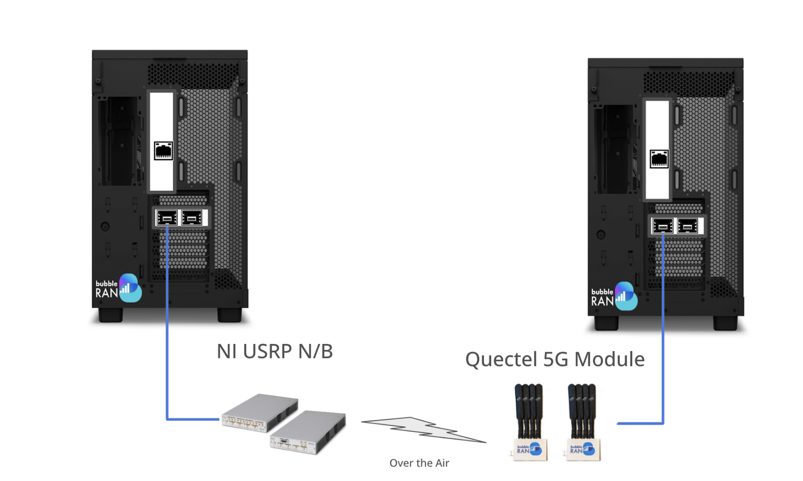

# Using the 5G SA Testbed Folder: OAI-CN, MX-RAN, MX-UE, MX-RIC and USRP

<!-- [toc] -->

## System Requirements and Testing

Tested on Intel AMD Ryzen 9 9950X 16-Core Processor.

**Minimum Recommended:**

* **CPU:** 12+ cores @ 3,8 GHz. **AVX-512 is a must-have.**
* **RAM:** 32 GB.
* **OS:** Modern Linux (e.g., Ubuntu 20.04).
* Docker & Docker Compose (latest stable).

Higher specs improve performance under load and with advanced monitoring.



The setup is required to have:
* **USRP B210**
* **QUECTEL rm520n**

## Special Requirements for UE Connection

* Use a COTS UE (e.g., Quectel RM500Q or 5G phone).
* Requires a SIM card configured with:
    * `imsi = "001010000000001"`
    * `key = "fec86ba6eb707ed08905757b1bb44b8f"`
    * `opc = "C42449363BBAD02B66D16BC975D77CC1"`
    * `dnn = "oai"`
    * `nssai_sst = 1`
    * `nssai_sd = 0xFFFFFF`
* Ensure frequency band compatibility with the USRP.
* UE should attach and obtain an IP for testing.
*  Open Cells Project programming tool uicc-v3.3 can be used to program SIM with the following command:
* sudo ./program_uicc --adm 12345678 --imsi 001010000000001 --isdn 00000001 --acc 0001 --key fec86ba6eb707ed08905757b1bb44b8f --opc C42449363BBAD02B66D16BC975D77CC1 -spn "OpenAirInterface" --authenticate)

### Running sequence

#### Open terminal 1

1. Run the cluster
```go
cd 5g-sa-usrp/

docker compose up -d
```

2. To check if quectel is connected, see mx-ran logs and check whether USRP is operational by ensuring blue LED light is up on the USRP module
```python
docker-compose logs mx-ran -f

# The logs should have all 4 LCID up like below
# LCID stands for Logical channel ID. They should have all 4 logical channel represent for carrying different type of data between network and QUECTEL

2025-05-02T14:39:15.760371705+02:00 UE RNTI 31fc CU-UE-ID 1 in-sync PH 0 dB PCMAX 0 dBm, average RSRP -44 (16 meas)
2025-05-02T14:39:15.760374050+02:00 UE 31fc: UL-RI 1, TPMI 0
2025-05-02T14:39:15.760375472+02:00 UE 31fc: dlsch_rounds 1064/0/0/0, dlsch_errors 0, pucch0_DTX 0, BLER 0.00000 MCS (0) 9
2025-05-02T14:39:15.760376895+02:00 UE 31fc: ulsch_rounds 212553/1/0/0, ulsch_errors 0, ulsch_DTX 0, BLER 0.00000 MCS (0) 28 (Qm 6  dB) NPRB 5  SNR 51.0 dB
2025-05-02T14:39:15.760378047+02:00 UE 31fc: MAC:    TX         130425 RX       18140316 bytes
2025-05-02T14:39:15.760379510+02:00 UE 31fc: LCID 1: TX            514 RX            278 bytes
2025-05-02T14:39:15.760380662+02:00 UE 31fc: LCID 2: TX              0 RX              0 bytes
2025-05-02T14:39:15.760381534+02:00 UE 31fc: LCID 4: TX          15735 RX          16411 bytes
```

#### Open terminal 2 for Quectel Ue

1. Install snap if you want to test
```python
# We develop a snap packages to control the quectel module in automation matter 
# which means there is no need to do deep configuration like running at-command 
# if you want to understand more, we can provide you the snap package 
# to try 

sudo snap install --devmode oai-ue.snap
```


3. Setup quectel information, check network interface
```python
# Connect the quectel model to the machine
# It will automatically create network interface and mount on /dev folder
# Sometime the interface can be different between wwp1s0u2i8 or wwa0

sudo oai-ue.conf edit quectel 
```

4. It will show you an edit view with the following information
```python
{
    "serial-device": "/dev/ttyUSB2",
    "network-interface": "wwp1s0u2i8", # Change this base on `ip a` command
    "default-apn": "oai",
    "sim-pin": "NULL",
    "lte-bands": "7",
    "nr-sa-bands": "78",
    "nr-nsa-bands": "78",
    "network-mode": "IPv4",
    "radio-preference": "NR-SA",
    "ims": "NULL",
    "sos": "NULL"
}
```

5. Init the quectel snap
```python
sudo oai-ue.init
```

6. Run the quectel snap
```python
sudo oai-ue.quectel
```

## Generating traffic

1. When the connection successfully, `wwp1s0u2i8` or `wwa0` will have ip assigned with 10.0.0.2
```python
# Run Iperf3 in your local machine
iperf3 -s 10.0.0.2
```

2. In OAI-CN
```python
docker exec -it oai-ext-dn iperf3 -B 192.168.70.135 -b 100M -c 10.0.0.2 -t 64800
```


## Directory Structure
This document provides information on how to use the contents of this directory
```bash
├── docker-compose.yaml
├── mx-conf/
├── oai-cn/
└── sqlite3/
```
## Important file and folder descriptions

### `docker-compose.yaml`

* **Description:** This is the primary Docker Compose file used to define and manage the multi-container Docker application within this scenario. It orchestrates the different services required for the 5G SA setup, such as the OAI Core Network (CN), any monitoring tools ( involving the data stored in the `sqlite3` folder), and the `mx` container.

* **Usage:**
    * **Starting the environment:** Navigate to this directory in your terminal and run:
        ```bash
        docker-compose up -d
        ```
        This command will start all the services defined in the `docker-compose.yaml` file in detached mode.
    * **Stopping the environment:** To stop all running containers, use:
        ```bash
        docker-compose down
        ```
    * **Viewing the status of services:** Check the status of the containers using:
        ```bash
        docker-compose ps
        ```
    * **Viewing logs of a specific service:** To see the logs of a container named `<service_name>` (defined in the `docker-compose.yaml`), use:
        ```bash
        docker-compose logs <service_name> -f
        ```
    * **Accessing a container's shell:** To get a shell inside a running container named `<service_name>`, use:
        ```bash
        docker-compose exec <service_name> bash
        ```
        or
        ```bash
        docker-compose exec <service_name> sh
        ```
### `sqlite3/data/`

* **Description:** This subfolder within `sqlite3/` is where the `mx-xapp` stores its monitoring data in SQLite database files.
* **File: `xapp_db`**
    * **Description:** This file, `xapp_db` (likely without a file extension, or potentially with `.db`), is the SQLite database file used by the `mx-xapp` to persist monitoring information. * **Usage:** * **Accessing the Database:** To read the data stored by the `mx-xapp`, you can use the `sqlite3` command-line tool. This tool allows you to interact directly with SQLite databases. * **Steps to Read `xapp_db`:**

            1.  **Ensure `sqlite3` is installed:** If you don't have the `sqlite3` command-line tool installed on your host system, you'll need to install it. The installation process varies depending on your operating system:
                * **Debian/Ubuntu:**
                    ```bash
                    sudo apt update
                    sudo apt install sqlite3
                    ```
                * **Fedora/CentOS/RHEL:**
                    ```bash
                    sudo dnf install sqlite
                    ```
                * **macOS:** If you have Homebrew installed:
                    ```bash
                    brew install sqlite3
                    ```

            2.  **Navigate to the `sqlite3/data` directory:** Open your terminal and change the current directory to the location of the `xapp_db` file within your project's `sqlite3/data` folder
                ```bash
                cd sqlite3/data
                ```

            3.  **Open the `xapp_db` database:** Use the `sqlite3` command followed by the filename:
                ```bash
                sqlite3 xapp_db
                ```

            4.  **Explore the database:** Once inside the SQLite shell, you can use various commands to inspect the database:
                * **.tables:** To list all the tables in the `xapp_db` database.
                    ```sqlite
                    .tables
                    ```
                * **.schema <table_name>:** To view the schema (structure) of a specific table. Replace `<table_name>` with the actual name of a table you found using `.tables`.
                    ```sqlite
                    .schema MAC_UE  -- Example: if a table is named 'MAC_UE'
                    ```
                * **.exit:** To exit the SQLite shell and return to your regular terminal prompt.
                    ```sqlite
                    .exit
                    ```

### `mx-conf/xapp.yaml` - `xapp_sub_cust_sm` Section

* **Description:** This section within the `xapp.yaml` file defines subscriptions to various Custom Service Models (SMs) for the `mx-xapp`. It allows you to specify which types of RAN information the xApp should receive and at what reporting frequency.

* **Key Configuration Parameters:**
    * `runtime_sec`: Sets the duration for which these subscriptions will be active. A value of `-1` typically means the subscriptions will run indefinitely.
    * Each numbered entry (e.g., `1:`, `2:`, `3:`) represents a distinct subscription to a Custom Service Model:
        * **`name`**: Specifies the name of the Custom Service Model to subscribe to (e.g., `mac`, `rlc`, `pdcp`).
        * **`periodicity_ms`**: Defines the reporting periodicity in milliseconds. This value determines how often the xApp will receive updates for the specified Service Model. **You can change this value** to adjust the frequency of the received monitoring data. Commonly supported values include `1`, `2`, `5`, `10`, `100`, or `1000` milliseconds.

* **Example Subscriptions:**
    ```yaml
    xapp_sub_cust_sm:
      runtime_sec: -1
      1:
        name: mac
        periodicity_ms: 10  # MAC layer information reported every 10 milliseconds
      2:
        name: rlc
        periodicity_ms: 100 # RLC layer information reported every 100 milliseconds
      3:
        name: pdcp
        periodicity_ms: 5   # PDCP layer information reported every 5 milliseconds
    ```

* **Supported Custom Service Models:** The `mx-xapp` and the underlying FlexRIC framework support various Custom Service Models, allowing you to monitor different aspects of the RAN. The example shows `mac`, `rlc`, and `pdcp`. **In addition to these, other supported Custom Service Models include:**
    * **`slice`**: For monitoring KPIs and information specific to network slices.
    * **`gtp`**: For monitoring data related to GTP (GPRS Tunneling Protocol) tunnels.

* **Adding or Modifying Subscriptions:** To subscribe to additional Custom Service Models or to change the reporting periodicity of existing ones, you can modify this `xapp_sub_cust_sm` section in the `xapp.yaml` file. Simply add a new numbered entry with the `name` of the desired Service Model and the `periodicity_ms` value. For example, to subscribe to the `slice` Service Model with a periodicity of 1000 milliseconds:

    ```yaml
    xapp_sub_cust_sm:
      runtime_sec: -1
      1:
        name: mac
        periodicity_ms: 10
      2:
        name: rlc
        periodicity_ms: 100
      3:
        name: pdcp
        periodicity_ms: 5
      4:
        name: slice
        periodicity_ms: 1000 # Slice-specific information reported every 1000 milliseconds
    ```
    
* **Specifics on USRP Module:** 
* Blue LED light should be on when USRP module is operational
* Link to USRP performance tuning options - https://kb.ettus.com/USRP_Host_Performance_Tuning_Tips_and_Tricks
* When making a bandwidth change on USRP (gnB) The system must be stopped and started. 
* There is no need to make changes to the Ue when making bandwidth changes. Ue will adapt to the gNB settings
* Bandwidth changes must be reflected in gNB config file
