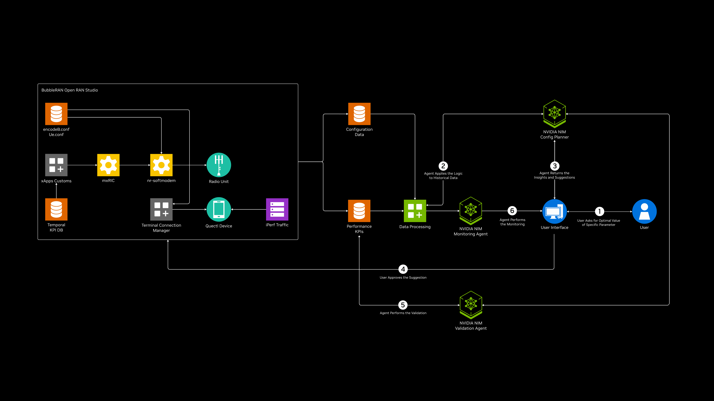
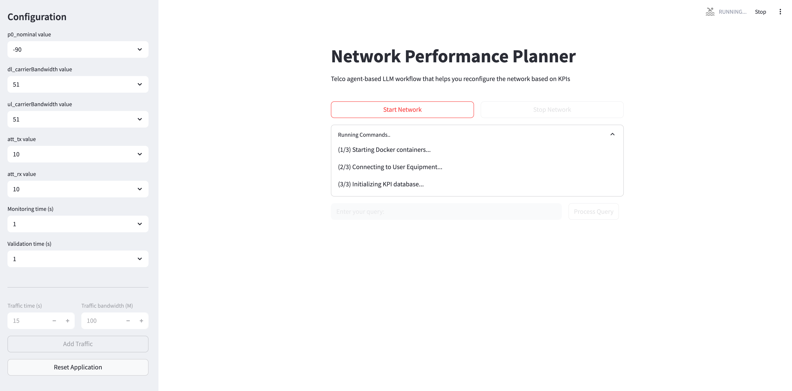
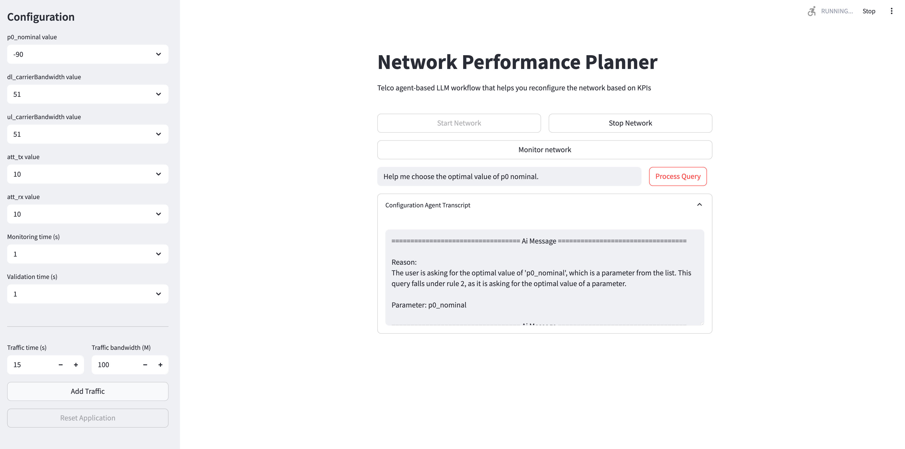
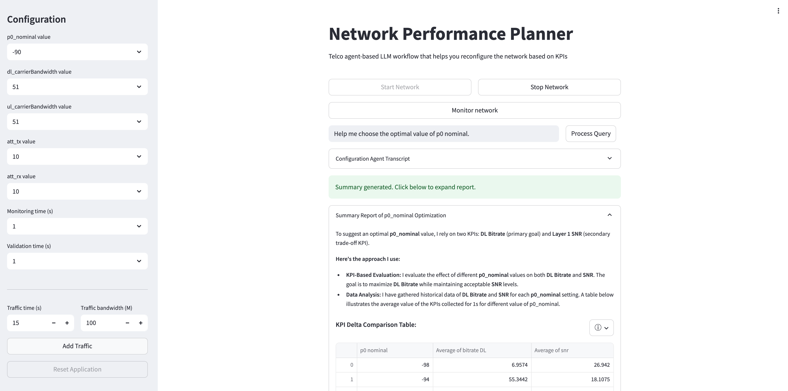
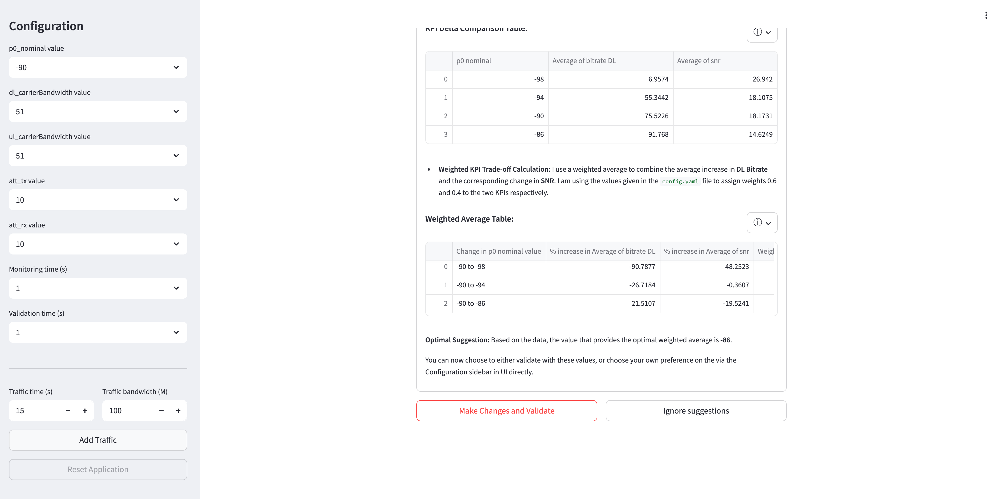
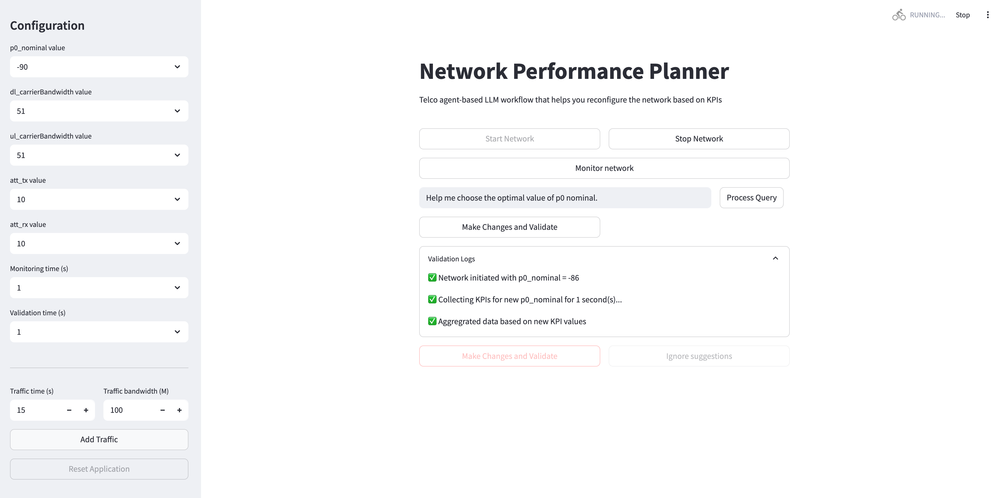
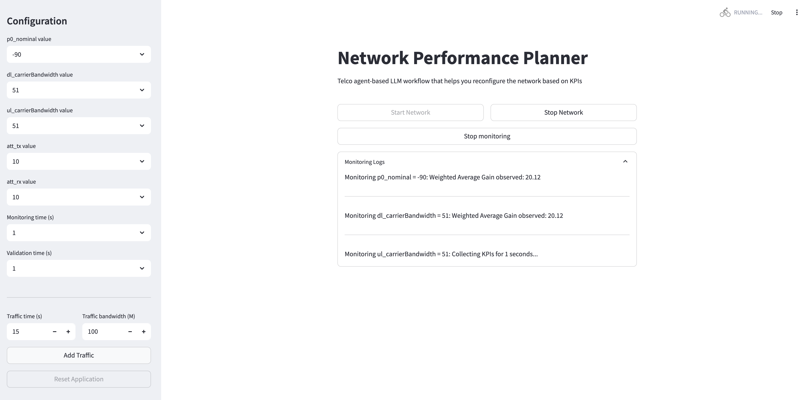
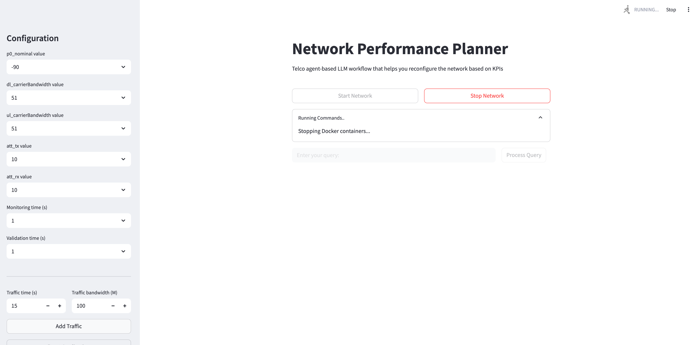

<h1>Network Performance Planner</h1>

## Overview

In a telecom network, configuration and optimization involve managing a complex set of interdependent parameters such as TDD patterns, tx/rx gain, scheduling algorithms, MCS selection, handover thresholds, and power control — all of which directly affect network performance, user experience, and spectrum efficiency. These parameters must be continuously tuned in response to changing conditions like time of day, user mobility, traffic patterns, interference, and service types.

NVIDIA has developed an **agentic AI blueprint**, built on the top of the BubbleRAN 5G O-RAN network, to bring autonomy into dynamic wireless environment. By observing real-time statistics (e.g., SNR, MCS or LDPC decoder iterations) and the resulting KPIs (such as DL/UL bitrate), the agents can make data-driven decisions and automatically adjust the configuration parameters. Unlike traditional rule-based SON, this agentic AI solution is capable of reasoning through complex trade-offs (e.g., higher downlink bitrate vs. SNR degradation), learning from feedback loops[*](#upcoming-features), and adapting to evolving conditions—either autonomously, without human intervention, or with manual oversight, depending on the use case.


The agents can also orchestrate changes across multiple layers (from PHY/MAC to RRC/NGAP) and multiple vendors, enabling coordinated actions like load balancing, inter-cell interference coordination, or power saving in underutilized areas. This level of autonomous control results in improved spectrum efficiency, higher quality of service, and significantly reduced operational complexity and time-to-resolution — especially critical in dense, high-demand RAN environments.


## Table of Contents
- [Overview](#overview)
- [Use case description](#use-case-description)
- [Target audience](#target-audience)
- [Software components](#software-components)
- [BubbleRAN 5G O-RAN Network Platform](#bubbleran-5g-o-ran-network-platform)
- [System Requirements](#requirements)
- [Directory structure](#directory-structure)
- [Quickstart guide](#quickstart-guide)
  - [Obtain NVIDIA API key](#step-1-obtain-your-nvidia-api-key)
  - [Setup the blueprint repository](#step-2-setup-the-blueprint-repository)
  - [Deploy the application](#step-3-deploy-the-application)
- [Example Walkthrough after UI Launch](#example-walkthrough-after-ui-launch-configuration-validation-and-monitoring)
- [Upcoming features](#upcoming-features)
- [Known issues and troubleshooting](#known-issues-and-troubleshooting)
- [Terminology](#terminology)
- [Important Links](#important-links)
- [Inviting the community to contribute](#inviting-the-community-to-contribute)
- [License](#license)


## Use case description

The goal of this blueprint is to develop an agentic AI workflow that provides insight to the end user on close-to-optimal configuration values for specific RAN parameters at a cell-site. While the initial focus is on RAN, the solution is designed with the flexibility to extend to other network domains such as core network (CN). Traditionally, finding optimal parameter values has involved lengthy trial-and-error and experimental processes, requiring deep domain expertise. This solution simplifies that process by automating data analysis and insight generation, allowing engineers to make informed decisions faster.

By leveraging both historical data (for insight) and real-time data (for monitoring), the system analyzes information from cells with similar characteristics to generate configuration recommendations. The **Config Planner Agent** ingests configuration parameters and historical statistics/KPIs from the network and, when prompted by the engineer (end-user), uses a LLM to analyze the aggregated data and return a table of suggested parameter values along with their expected performance impacts.

Once a new configuration is selected by the user based on these insights, the **Validation Agent** applies the new setting to the cell-site and validates real-time KPIs over a configurable time period. It compares the new KPIs against previous values using a weighted average (other comparison methods are possible). Indicatively, if performance degrades (reduction in weighted average), the system automatically reverts to the original configuration. If there is no degradation — i.e., the weighted average of post-change KPIs remains at or above the previous baseline — the new configuration is retained. It has to be noted that parameter reconfiguration (day 2 operation) might break the service continuity if a restart is required to apply it. 

Additionally, the **Monitoring Agent** allows the user to continuously monitor the weighted average gain for each parameter. It aggregates KPIs over a configurable time window, and if the weighted average falls below zero for any monitored parameter, it prompts the user. At that point, the user can choose to hand over control to the configuration agent, which will then re-initiate the optimization process and suggest an updated optimal value. This enables proactive performance tuning while keeping the user in control.

For more details on the agentic workflow, please refer to [this documentation](./agentic_llm_workflow/README.md/#overview).

> Please refer to the [Terminology](#terminology) section for explanations of different terms.




## Target Audience

* **RAN Operators:** Utilize the framework to optimize network performance efficiently. 

* **Network Engineers/Installers:** Reduce manual effort and get data-driven configuration recommendations. 

* **Telecom Companies:** Improve network performance and customer satisfaction. Extend this use case for additional Telco-related services. 

* **Blueprint Users:** Show the effectiveness of NIM-based LangGraph frameworks in addressing the domain-specific data and configurations. 

* **Researchers/Developers:** Experiment and improve the blueprint along network slicing with conflicting RAN reconfiguration parameters for different slices and explore how different RAN slices could be jointly optimized. Explore the interplay with O-RAN APIs. 


## Software components

* Agents and response generation: 
[NVIDIA NIM  meta/llama-3.1-70b-instruct](https://build.nvidia.com/meta/llama-3_1-70b-instruct)
* 5G O-RAN Network Platform - [BubbleRAN](#bubbleran-5g-o-ran-network-platform)
* Orchestrator Agent - [LangGraph](https://www.langchain.com/langgraph)
* Database - [SQLite](https://www.sqlite.org/)
* Structured Query Language Interface - [sqlite3](https://docs.python.org/3/library/sqlite3.html)
* User Interface - [Streamlit](https://streamlit.io/)

## BubbleRAN 5G O-RAN Network Platform

To simplify the deployment and **make it available to everyone**, we make use of Docker Compose to deploy an end-to-end 5G O-RAN network in one system, including MX-5G (based on OpenAirInterface software stack) and MX-RIC products, with a single command. For a production deployment, please refer to [MX-PDK](https://bubbleran.com/products/mx-pdk/) and [MX-AI](https://bubbleran.com/products/mx-ai/) products.  

The deployment file features MX-5G, comprising the Core Network and Radio Access Network, and MX-RIC, a Radio Intelligent Controller and SDK/xApp. This powerful combination empowers end-users, including innovators like NVIDIA, to implement and experiment a range of AI-driven solutions to perform comprehensive actions of the MX-5G infrastructure. 

We provide two Docker Compose configurations to suit different needs: 
* **Simulation Environment (RF-Sim mode):** This setup simulates 5G user equipment (e.g., smartphones) connecting to the MX-5G network, ideal for development and testing. 
* **Over-the-Air Environment using USRP (USRP mode):** This mode allows the actual user equipment, such as 5G mobile phones or Quectel modules, to establish an over-the-air (wireless) connections with the  MX-5G. Please note that this option necessitates coordination with BubbleRAN for environment provisioning due to the requirement of radio hardware (e.g., USRPs or O-RAN 7.2 RU) and specific modules. 

For more [detailed explanation of the BubbleRAN environment](https://hackmd.io/@cqJBhbgpTAaFyWlljbNPQQ/HyLxO-Ylge), please refer to the respective README file in the two directories named [5g-sa-nr-sim](./5g-sa-nr-sim/README.md) and [5g-sa-usrp](./5g-sa-usrp/README.md).   

In our blueprint, you can start and stop the network via the User Interface. The [Quickstart guide](#quickstart-guide) section lists the steps to setup the blueprint. 

To independently run the BubbleRAN network **without** the blueprint, please refer to the [System Requirements](#requirements) and follow the steps below:

**Start network:** Run the docker command to start the BubbleRAN network:
```bash
docker compose up -d
```
or explicitly specify the Compose file:

```bash
docker compose --file docker-compose.yaml up –d 
```

**Check network and connect UE:** Check the MX-RAN logs, you should see the following non-consecutive logs: 

```
[GNB_APP]   [gNB 0] Received NGAP_REGISTER_GNB_CNF: associated AMF 1 
[GTPU]   Configuring GTPu address : 192.168.70.140, port : 2152 
[PHY]   gNB L1 are configured 
13:12:23.917923 [INFO]:  msg_handler_agent.c:342 E2 SETUP RESPONSE rx 
[HW]   RAU has loaded USRP B200 device. 
[NR_MAC]   Frame.Slot 384.0 
[NR_MAC]   Frame.Slot 512.0 
```

You can now connect the mobile phone. 

**Stop network:** To stop the container, run this command:  

```bash
docker compose --file docker-compose.yaml down 
```

For more information about the BubbleRAN turnkey 5G O-RAN solutions, please refer [here](https://bubbleran.com/products/mx-pdk/).


## Requirements

Before deploying this blueprint, ensure that your system meets the requirements for both the Agentic LLM Workflow and the BubbleRAN Environment.


### Agentic LLM Workflow Requirements

* sudo privileges to system
* Python 3.10+ (Python 3.10 recommended)
* OS: Modern Linux (e.g., Ubuntu 22.04)
* NVIDIA API keys (see [this](#step-1-obtain-and-set-up-nvidia-api-key) section for details)
* [Docker and Docker Compose](https://docs.docker.com/get-started/get-docker/) (optional, only if you wish to deploy with Docker).


#### Deployment Options

- **Using NVIDIA API Catalog NIM Endpoints**: You can deploy on any standard (non-GPU or GPU) machine or VM.

- **Hosting NVIDIA NIM Locally**: Ensure the requirements listed below:
  - An NVIDIA AI Enterprise Developer License
  - Specifications outlined in the [Meta Llama 3.1 70B Instruct Support Matrix](https://docs.nvidia.com/nim/large-language-models/latest/supported-models.html#llama-3-1-70b-instruct)


### BubbleRAN Environment Requirements
* CPU: 12+ cores @ 3,8 GHz, AVX-512 is necessary
* RAM: 32 GB
* OS: Modern Linux (e.g., Ubuntu 22.04)
* Docker & Docker Compose (latest stable)

This blueprint has been extensively tested on an AMD Ryzen 9 9950X 16-Core Processor. However, any system meeting the above requirements should be sufficient.

You do not need any additional requirements to deploy in **RF-Sim** mode. However, to deploy BubbleRAN in **USRP mode**, the following additional hardware and configuration settings are required:

* NI USRP B210 
* QUECTEL RM520n 
  * imsi = "001010000000001" 
  * key = "fec86ba6eb707ed08905757b1bb44b8f" 
  * opc = "C42449363BBAD02B66D16BC975D77CC1" 
  * dnn = "oai" 
  * nssai_sst = 1 
  * nssai_sd = 0xFFFFFF 

Please refer to [this](#bubbleran-5g-o-ran-network-platform) section for information on the different BubbleRAN modes, and the respective README file in the two directories named [5g-sa-nr-sim](./5g-sa-nr-sim/README.md) and [5g-sa-usrp](./5g-sa-usrp/README.md).   


## Directory structure

```bash

├── 5g-sa-nr-sim/              # Directory for 5G Standalone simulation environment (non-radio)
│                              # Please refer to README.md in this directory for more details
├── 5g-sa-usrp/                # Directory for 5G SA deployment using USRP hardware
│                              # Please refer to README.md in this directory for more details
├── agentic_llm_workflow/      # Directory for Agentic LLM agents, tools and their orchestration
│                              # Please refer to README.md in this directory for more details
├── config.yaml                # Global configuration file
├── data/                      # Directory for historical data, and databases generated during runtime
├── docker-compose.yaml        # Docker Compose setup for blueprint orchestration
├── Dockerfile                 # Base Docker image for core components
├── images/                    # Reference images and visual assets
├── LICENSE.md                 # License details for agentic LLM workflow
├── LICENSE_BubbleRAN.md       # License details for BubbleRAN
├── README.md                  # Project documentation (this file)
├── requirements.txt           # Python dependencies
├── telco_planner_setup_notebook.ipynb        # Jupyter Notebook for setting up the app
└── telco_planner_ui.py        # Main Python module for telco network planning UI

```

## Quickstart Guide

You can set up this application in three easy steps. If you encounter any issues during this process, please refer to the [Known issues and troubleshooting](#known-issues-and-troubleshooting) section.


### Step 1: Obtain your NVIDIA API key and access NVIDIA NIM

If you don’t already have an NVIDIA API key, please follow the instructions listed in the [NVIDIA NIM Getting Started Guide](https://docs.nvidia.com/nim/large-language-models/latest/getting-started.html#launch-nvidia-nim-for-llms). You can generate the key either via the [API Catalog](https://docs.nvidia.com/nim/large-language-models/latest/getting-started.html#generate-an-api-key) or through [NGC](https://docs.nvidia.com/nim/large-language-models/latest/getting-started.html#option-2-from-ngc), both of which include detailed steps and screenshots.

<!-- If you don’t already have an NVIDIA API key, follow the instructions provided in the [NVIDIA NIM Getting Started Guide](https://docs.nvidia.com/nim/large-language-models/latest/getting-started.html#launch-nvidia-nim-for-llms). You can generate your API key through either of the following methods, both of which include detailed steps and screenshots:

- Via the [API Catalog](https://docs.nvidia.com/nim/large-language-models/latest/getting-started.html#generate-an-api-key)
- Via [NGC](https://docs.nvidia.com/nim/large-language-models/latest/getting-started.html#option-2-from-ngc) -->

Make sure to save your API key securely. Now we can export the API key in your terminal by this command:

```bash
export NGC_API_KEY="nvapi-***"
```

After you export the `NGC_API_KEY`, you have two options for accessing Llama-3.1-70b-instruct for the Agentic LLM workflow:

* **NVIDIA API Catalog NIM Endpoints** (default) — no GPU or local hosting required

* **Host NVIDIA NIM Locally** — run NVIDIA NIM directly on your own GPU-equipped machines for improved latency and maintain full control over your infrastructure.

To **deploy locally hosted NIMs** for Llama 3.1 70B Instruct, please follow the instructions on the [NVIDIA Build page for Llama-3.1-70b-instruct](https://build.nvidia.com/meta/llama-3_1-70b-instruct/deploy?environment=linux.md). Authenticate using your NGC API key, and be sure to update the necessary values in your `config.yaml` file — see the next step for configuration details.


### Step 2: Setup the blueprint repository

Clone this repository in your system and navigate to the root of the directory:
```bash 
git clone https://bubbleran.com/Telco-Network-Configuration
```

Setup the following values in the `config.yaml` file:
- **`nvidia_api_key`**: Required to access NeMo services and the language model. Update this field with your NVIDIA API key, which should follow the format `"nvapi-b***"`.

- **`bubbleran_network_setup`**: Defines the BubbleRAN environment setup. The default value `"5g-sa-nr-sim"` runs in RF-Sim mode. To switch to USRP mode, set this field to `"5g-sa-usrp"`.

- **LLM Parameters**:
  - `llm_model`: Specifies the API Catalog model endpoint. The default is `meta/llama-3.1-70b-instruct`.
  - `NIM_mode`: Indicates whether to use locally hosted NIMs (`True`) or NVIDIA API Catalog endpoints (`False`). Ensure you have NIMs running **before** setting to `True`.
  - `nim_image`: The Docker image for the locally hosted NIM. We recommend using `nvcr.io/nim/meta/llama-3.1-70b-instruct:latest`.
  - `nim_llm_port`: Port where your local NIM is running. Default is `8000`.

For additional customization options, please refer to the [Configuration section](./agentic_llm_workflow/README.md#configuration) of the documentation.


### Step 3: Deploy the application

You can deploy the UI using any of the following methods:
* Deploy in bare metal with Python virtual environment
* Deploy with Docker
* Deploy with Jupyter Notebook

> After deployment, we strongly recommend reviewing the [Walkthrough](#example-walkthrough-after-ui-launch-configuration-validation-and-monitoring) section for guidance on use of this blueprint.

**Option 1: Bare Metal (Python Virtualenv)**

Create and activate python virtual environment
```bash
pip install virtualenv 	## if you don't already have virtualenv installed
python3.10 -m virtualenv bp_env
source bp_env/bin/activate
```
Go to the root directory of the repository, and install the requirements in the virtual environment.
```
pip install -r requirements.txt
```

Start the UI by running the following file with `streamlit`:
```bash
streamlit run telco_planner_ui.py
```
The application can be launched on the the web browser through specified port, i.e., [`localhost:8501`](http://localhost:8501). If your machine has ports being forwarded on the public IP, it can be accessed by other people who can use `<IP_ADDR>:<PORT>` to access the application. If there are any issues accessing the localhost browser port, refer to [troubleshooting tips here](#known-issues-and-troubleshooting).


Finally you can use the application to monitor, configure or validate the BubbleRAN network. To stop the running services, simply press `Ctrl+C` in the terminal where the UI is running.

To fully reset the environment and databases for a fresh start, run the provided reset script:
```bash
sudo ./agentic_llm_workflow/reset.sh
```

**Option 2: Deploy with Docker**

Before proceeding, please make sure you have docker installed. Else, please follow the steps below:
* Install Docker Engine and Docker Compose. Refer to the instructions [here](https://docs.docker.com/get-started/get-docker/).
* Ensure the Docker Compose plugin version is 2.29.1 or higher.
* Run `docker compose version` to confirm.
* Refer to [Install the Compose plugin](https://docs.docker.com/compose/install/linux/) in the Docker documentation for more information.

Navigate to the root of this directory and, and run this command:
```bash
docker compose up --build
```
The application can be launched on the the web browser through specified port, i.e., [`localhost:8501`](http://localhost:8501). If your machine has ports being forwarded on the public IP, it can be accessed by other people who can use `<IP_ADDR>:<PORT>` to access the application. If there are any issues accessing the localhost browser port, refer to [troubleshooting tips here](#known-issues-and-troubleshooting).

Finally you can use the application to monitor, configure or validate the BubbleRAN network. 


**Option 3: Deploy with Jupyter Notebook**

To deploy with Jupyter Notebook, please ensure you have Jupyter Notebook setup and follow the steps mentioned in [this](./telco_planner_setup_notebook.ipynb) notebook.


## Example Walkthrough after UI Launch: Configuration, Validation and Monitoring

The following walkthrough demonstrates a representative end-to-end flow of how the application can be used once the user interface is initialized. It highlights key interactions such as parameter configuration, live monitoring, and performance validation using the 5G network environment.


**Step 1 → User Selects Parameters and Starts Network**  
The user selects required parameters from the dropdown lists in the UI and clicks the **Start Network** button.  
This launches the following services as part of the 5G network setup:  
- **5GC** (5G Core)  
- **NR gNB** (Next-Gen Radio Node)  
- **UE** (User Equipment)  
- **MX-RIC** (RIC platform)  
- **xApp** (control apps) + **Database**


<div align="center">
  
</div>

**Step 2 → User Request to Configuration Agent**  
An engineer enters the query via the textbox and clicks on **Process Query** button. Some examples queries are:
> *“What’s the optimal p0 nominal value?”*

> *“My current ul carrierbandwidth value is 51. Is there a better configuration?”*

> *“Help me choose best value for att_rx”*

Note that the Configuration Agent will only answer queries related to the five parameters.

<div align="center">
  
</div>

**Step 3 → Reasoning with Configuration Agent**  
The agent reasons through different steps and performs the following tasks:  
- Generates and executes queries on historical data  
- Applies weighted average logic on key KPIs  
- Selects the configuration that maximizes the weighted KPI score

<div align="center">
  
</div>

**Step 4 → Deploy to Validation Phase**  
If the Configuration Agent recommends a new optimal parameter value, and then the user can select whether to **Make Changes and Validate** or **Ignore Suggestions**.

<div align="center">
  
</div>

If the user clicks on the **Make Changes and Validate** button, the system proceeds as follows:  
- Deploys the new configuration in the real-time 5G setup for validation  
- Collects live KPI data under the new configuration and stores it in a persistent database  
- Compares the weighted average of new KPIs (post-config) against the baseline (pre-config): 
  - If **performance improves or is maintained** (relative weighted average ≥ 0):  
    ➤ Keep the new configuration  
  - If **performance degrades** (relative weighted average < 0):  
    ➤ Revert to the original configuration


<div align="center">
  
</div>

**Step 5 → Continuous Monitoring**  
The Monitoring Agent can be started at any point by clicking on the **Start Monitoring** button. It continuously tracks the weighted average (WA) gain for each parameter in a cyclic manner.  

If a parameter's WA gain drops below the baseline, it prompts the user and the control is passed back to the Configuration Agent for a new recommendation
   
<div align="center">
  
</div>

**Step 6 → Stop Network and Reset**  
The user can stop the 5G network by clicking the **Stop Network** button to shut down all active services. 

(Optional)To reset the environment and databases for a fresh start, the user can run the provided reset script.  

<div align="center">
  
</div>


## Upcoming features

We are actively working on several enhancements to improve flexibility, user control, and automation in the decision-making process. Key features planned for the future releases include:

- **Custom KPI Input via UI:**  Recognizing that different telecom operators may prioritize different KPIs, we will introduce a conversational interface with LLM. This will allow engineers to specify their target KPIs and assign relative weights using natural language input, enabling more personalized and goal-oriented configuration strategies.

- **Goal-Based Configuration Selection:**  Users will be able to select configurations based on presented trade-off tables aligned with their objectives. For example, if the goal is to maximize downlink (DL) throughput, users can explicitly define how much degradation in other KPIs (e.g., latency or energy consumption) is acceptable to achieve that goal.

- **Autonomous Blueprint Execution:**  For operators choosing to run the system in fully autonomous mode (without human-in-the-loop decision approval), we will provide mechanism to indicate the intention to allow autonomous changes. The user can then define acceptable degradation thresholds for different KPIs, enabling the agent to pause changes if thresholds are exceeded.

- **SQL Distillation:**    To enhance performance and reduce resource consumption, we plan to fine-tune a smaller, specialized model capable of replicating the SQL generation and reasoning processes currently handled by larger models for this specific workflow. This will enable more efficient deployment in production environments without compromising capability.

- **Reinforcement Learning Feedback Loop:**  User feedback and agentic reasoning traces will be leveraged to fine-tune agent behavior over time using reinforcement learning techniques, enhancing performance and decision relevance.


## Known issues and troubleshooting
- **Application not reachable:**  If you are using a remote machine to run this application and can not access the app, you can do port forwarding to your local browser by running this command in your remote terminal:
  ```bash
  sudo ufw allow 8051
  ```
  Alternatively, you can ssh to the remote server with port forwarding:

  ```bash
  ssh -L PORT:IP_ADDR:PORT localhost
  ```

- **Slow or delayed responses:**: If you experience unusually slow response times, it may be due to a busy API catalog or a large network database. Locally deployed NIMs typically offer lower latency. To improve performance, you can reset the database by running the `sudo ./agentic_llm_workflow/reset.sh` command in the terminal.
 

- **Running out of API credits:** If you run out of credits for the NVIDIA API Catalog, you will need to obtain more credits to continue using the API. Please contact your NVIDIA representative to get more credits added.

- **Variability in LLM Responses:** Language model outputs may occasionally vary due to inherent stochasticity (e.g., temperature, model configuration). If unexpected behavior occurs, rerun the same command to obtain a more consistent result.

- **High `att_tx` / `att_rx` Values:** Excessive attenuation might lead to UE disconnection or failure to start the network. In such a case, please ensure attenuation values remain within the lower range of 0–20 and restart the network.

- **Network Fails to Stop/Start:** If the network fails to start or stop, or you want to reset the setup, run `reset.sh` to reset the environment and databases.

- **LLM or UI Errors:** Refresh the browser page to resolve temporary interface or response issues.

- **USRP Traffic Setup:** To generate traffic in the USRP setup, please make sure to follow the readme file. The traffic can not be added via UI in USRP setup and without the addition of a user equipment externally.

## Terminology
* **KPI:** A measurable metric that indicates how effectively the network is performing. KPIs are essential for monitoring, optimizing, and managing the quality of service (QoS), user experience, and network efficiency.
* **Parameter:** Here parameter refers to 5G configuration parameters used by the Radio Access Network (RAN) or core network to determine how to perform specific operations or make decisions, such as determining handover conditions or transmission power levels. For example, `p0_nominal`, `att_rx`, and others.
* **Weighted Average Gain:**  A performance metric that calculates the difference in the weighted average of KPIs at a specific parameter setting compared to a baseline. Each KPI is assigned a weight to reflect its relative importance.
* **Historical KPI/ database:** Database of past network performance metrics collected in BubbleRAN 5G network, used as a reference for decision-making during network configuration. This data, stored in `data/historical_data.csv`, helps identify trends, evaluate past outcomes, and inform parameter optimization.
* **Real time database:** Database that captures and stores KPIs in real time, as recorded by BubbleRAN environment. This database drives decisions of the agents during monitoring and validation cycles by enabling access the most current data.
* **Agent:** A LangGraph-based autonomous agent utilizing the Llama 3.1 language model. It is equipped with tools, domain-specific context, and prompt-tuned logic to perform complex decision-making tasks without human intervention.
* **Tools:** Predefined LangGraph tools (such as `execute_sql_query`) that an agent can invoke to interact or make changes in the network and databases.
* **DL/UL:** Downlink and Uplink. DL refers to data transmission from network to user device; UL refers to data sent from user device to network.
* **SNR:** Signal to Noise ratio. A measure of signal strength relative to background noise. A higher SNR typically indicates better signal quality and communication reliability.
* **LDPC:** LDPC is a forward error correction (FEC) method that uses a sparse parity-check matrix to detect and correct errors in transmitted data without needing retransmission.
* **MCS:** Modulation and Coding scheme, determines how data is encoded and modulated for transmission. 
* **TDD:** Duplexing technique where uplink (UL) and downlink (DL) transmissions share the same frequency band but occur at different times.
* **tx/rx:** Transmission (TX) and reception (RX) of radio signals in communication systems.
* **att_rx/att_rx**: Signal attenuation levels during transmission (att_tx) or reception (att_rx). These values help manage power levels, compensate for signal loss, and optimize overall link performance in a 5G network.
* **PHY:** Physical Layer, the lowest layer in the OSI (Open Systems Interconnection) model and the 5G NR protocol stack.
* **MAC:** Medium Access Control, a sub-layer of the data link layer in the 5G NR protocol stack and sits just above the PHY (Physical) layer.
* **RRC:** Radio Resource Control, protocol in the control plane responsible for connection establishment, reconfiguration, mobility control, and security between the device and the network.

## Notes
In the OAI configuration, tx_gain and rx_gain are not set directly. Instead, OAI uses the att_tx and att_rx parameters to control the effective gain. The actual tx_gain and rx_gain values depend on the SDR/RU hardware specifications, which define their maximum gain levels.
For the USRP B210 we’re using, the maximum TX gain is approximately 90, and the maximum RX gain is approximately 70. So:
When we set att_tx = 0 and att_rx = 0, the actual tx_gain and rx_gain are 90 and 70, respectively.
When we set them to 10, the actual tx_gain and rx_gain become 80 and 60, respectively. 
So the formula is: [Tx_gain = 90 - att_tx] and [Rx_gain = 70 - att_rx] for USRP B210.
The original (historical) data is based on gain values, subtract those from 90 or 70, respectively, to get the corresponding attenuation values.

## Important Links
TODO: add links
* [NVIDIA Agentic AI Blueprints](https://blogs.nvidia.com/blog/agentic-ai-blueprints/)
* [Link to blog]()
* [Link to build.nvidia page]()
* [Link to BubbleRAN Blog](https://bubbleran.com/news)
* [Link to MX-PDK](https://bubbleran.com/products/mx-pdk/)
* [Link to MX-AI](https://bubbleran.com/products/mx-ai)


## Inviting the community to contribute

We welcome contributions from the community and value your feedback, comments, and ideas.
To contribute, please follow these steps:

1. **Fork** this repository to your GitLab account.
2. **Create a new feature branch** from the `main` branch.
3. **Make your changes** with clear, concise commits. Remember to sign off the comment with `-s` flag. For example, `$ git commit -s -m "Add xyz feature"`
4. **Submit a merge request (MR)** with a detailed description of your changes and any relevant context.


Thank you for helping improve and spread this project!

## License

Please refer to [blueprint license](./LICENSE.md) and [BubbleRAN license](./LICENSE_BubbleRAN.md) for details.

## Disclaimer

*This Telco Network Configuration Blueprint is shared as reference and is provided "as is". The security in the production environment is the responsibility of the end users deploying it. When deploying in a production environment, please have security experts review any potential risks and threats; define the trust boundaries, implement logging and monitoring capabilities, secure the communication channels, integrate AuthN & AuthZ with appropriate access controls, keep the deployment up to date, ensure the containers/source code are secure and free of known vulnerabilities. This blueprint downloads and uses 3rd party containers for 5G Core Network from OpenAirInterface. The end users must use the latest and most stable version of the software.*

## Contributors 

1. [Swastika Dutta](https://www.linkedin.com/in/swastika-dutta/), Solution Architect NVIDIA
2. [Ari Uskudar](https://www.linkedin.com/in/ari-u-628b30148/), Product Manager, NVIDIA.
3. [Maria Amparo Canaveras Galdon](https://www.linkedin.com/in/amparo-canaveras-b2152522/), Senior Solution Architect, NVIDIA
4. [Spencer Gawe](https://www.linkedin.com/in/spencer-gawe-dr-40931a13/), Solution Architect, NVIDIA
5. [Mikel Irazabal](https://www.linkedin.com/in/mikel-irazabal-41777a46/), Principal Engineer, BubbleRAN
6. [Khai Duc Nguyen](https://www.linkedin.com/in/khaidnguyen11/), O-RAN Engineer, BubbleRAN
7. [Ali Yagoubian](https://www.linkedin.com/in/ali-yaghoubian/), Ph.D. Student, Eurecom
