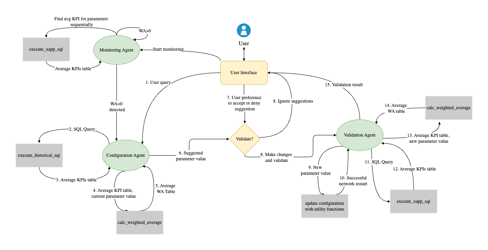

<h1>Telco Agentic AI Workflow with NVIDIA NIMs</h1>

## Table of Contents
- [Overview](#overview)
- [Directory structure](#directory-structure)
- [Configuration](#configuration)
- [Details of agents](#details-of-agents-in-the-langgraph)
- [Details of tools](#details-of-different-tools-accessed-by-agents)
- [Details of utilities](#details-of-utilities)
- [System requirements](#system-requirements)
- [Quickstart guide](#quickstart-guide)
- [Known issues and troubleshooting](#known-issues-and-troubleshooting)

## Overview

In this Blueprint, we leverage NVIDIA Inference Microservices (NIMs) to deploy our Agentic LLM Framework. After careful evaluation, we selected Llama 3.1-70B-Instruct as the foundational model due to its robust performance in natural language understanding, reasoning, and tool calling. 


End-users interact through a **Streamlit-based user interface (UI)** to submit their queries or initiate network operations. These queries are processed by a LangGraph Agentic Framework, which orchestrates the specialized LLM agents. 

The LLM agents are equipped with specialized tools that allow them to generate and execute SQL queries on both real-time and historical KPI data, calculate weighted average gains of the collected data, apply configuration changes and handle the BubbleRAN environment. Please refer to [this section]() for more details on the different tools.

We leverage **prompt-tuning** to inject contextual knowledge about the BubbleRAN network architecture, including the setup details and the interdependencies between various KPIs and the logic for balancing trade-offs to optimize weighted average gains 

The LangGraph-powered Agentic Framework orchestrates three specialized agents, each with distinct responsibilities that work together to close the loop of monitoring, configuration, and validation. Once the user initializes the network with selected parameters, they can choose between a monitoring session with Monitoring Agent or directly query the Configuration Agent to understand parameter impacts and network status. 



## Directory structure
The `agentic_llm_workflow` directory contains all core components for running, monitoring, and optimizing the BubbleRAN environment using agent-based orchestration and LLMs.
```bash

└── agentic_llm_workflow/     # Directory for Agentic LLM agents, tools and their orchestration
   ├── agents.py              # Defines agent logic and decision-making flow
   ├── tools.py               # LangGraph-compatible tools for network and database interaction
   ├── utils.py               # Utility functions for managing RAN setup, traffic, and database sync
   ├── reset.sh               # Shell script to reset the application and clear all database
   └── README.md              # Documentation for agentic workflow and tools

```
## Configuration

The `config.yaml` file located in the root directory ([view here](../config.yaml)) allows customization of several fields for your specific use case. While **we strongly recommend not changing certain values** such as LLM temperature or model parameters, you can safely modify the following fields as per the instructions below:

- **`nvidia_api_key`**: Required to access NeMo services and the language model. Update this field with your NVIDIA API key, which should follow the format `"nvapi-b***"`.

- **`bubbleran_network_setup`**: Defines the BubbleRAN environment setup. The default value `"5g-sa-nr-sim"` runs in RF-Sim mode. To switch to USRP mode, set this field to `"5g-sa-usrp"`.

- **LLM Parameters**:
  - `llm_model`: Specifies the API Catalog model endpoint. The default is `meta/llama-3.1-70b-instruct`.
  - `NIM_mode`: Indicates whether to use locally hosted NIMs (`True`) or NVIDIA API Catalog endpoints (`False`).
  - `nim_image`: The Docker image for the locally hosted NIM. We recommend using `nvcr.io/nim/meta/llama-3.1-70b-instruct:latest`.
  - `nim_llm_port`: Port where your local NIM is running. Default is `8000`.

- **Network Environment Parameters**:
  - `default_p0_nominal_value`: Initial or fallback value for the `p0_nominal` parameter. Ensure this value exists in the `p0_nominal_values` list.
  - `p0_nominal_WA_weights`: Weights used to compute the average of the two KPIs associated with `p0_nominal`, i.e., DL Bitrate and SNR.
  - Similarly, you can configure default values and weighted average (WA) weights for other network parameters — `dl_carrierBandwidth`, `ul_carrierBandwidth`, `att_tx`, and `att_rx` — by following the inline comments in the `config.yaml` file.

## Details of agents in the LangGraph

Customers have the flexibility to deploy this Blueprint via: 
* NVIDIA’s hosted NIMs API endpoints at build.nvidia.com, or 
* On-premises NIMs to meet privacy, and latency requirements. 

Please refer to [this section](../README.md/#quickstart-guide) to deploy this application.

### Monitoring Agent 

This agent continuously tracks the average weighted gain of pre-selected parameters in user-defined time intervals (default: 10 seconds) on real-time BubbleRAN KPI database. When it detects performance degradation due to reduction in Weighted Average Gain of a specific parameter, it raises the issue to the user for authorization of next step. 

### Configuration Agent 

The Configuration Agent can be activated by the Monitoring Agent’s hand-off, or direct user queries about parameter optimization or network health. It analyses historical data, reasons through the analyzed trends and domain-specific knowledge of parameter interdependencies and trade-offs. Based on its analysis, it suggests improved parameter values to the user and waits for user confirmation. 

### Validation Agent 

Once parameter adjustments are confirmed, the Validation Agent restarts the network with the new parameter configuration. It evaluates the updated parameters over a user-configurable validation period and calculates the resulting average weighted gain. If the real-time average weighted gain deteriorates further, it automatically rolls back to the previous stable configuration. Otherwise, it confirms success and updates the UI with the new settings. 

## Details of different tools accessed by agents

### execute_xapp_sql Tool
The SQL Execution Tool is used by agents that need direct access to the persistent database. It takes a user- or agent-specified SQL query, executes it on the stored persistent SQLite database, and returns the result as a cleanly formatted table string. This allows agents to retrieve or inspect structured data on demand without requiring manual database access.

### execute_historical_sql Tool
The Historical SQL Tool provides agents with access to long-term KPI data stored in the historical database. It executes agent-specified SQL queries against this dataset and returns the results as a formatted table string. This enables agents to analyze past performance trends, validate assumptions, or support time-based reasoning during diagnostics and optimization.


### find_value_in_gnb Tool
The GNB Config Reader allows agents to retrieve specific parameter values from the gNodeB configuration file. When provided with a parameter name, it searches the file and returns the corresponding integer value. This enables agents to verify or reason over current radio access network settings during diagnostics, optimization, or compliance checks.


### calc_weighted_average Tool 
The Weighted Gain Calculator enables agents to evaluate parameter impact by computing percentage changes and weighted average gains relative to a baseline configuration. Depending on the agent call, it can use either the historical KPI data or the persistent live KPI data, and user-defined weights, to quantify the trade-offs between different parameter settings, supporting data-driven decision-making during optimization.


### update_value_in_gnb Tool
The GNB Config Updater enables agents to modify parameters in the gNodeB configuration files. It supports both direct scalar updates (e.g., p0_nominal, att_tx) and complex bandwidth profile changes that require coordinated updates across multiple fields and files. By updating these configurations programmatically, agents can dynamically adapt the RAN setup to match user preferences, or optimization outcomes.

## Details of utilities

### check_network_status()
The Network Status Checker allows agents to verify the operational state of the BubbleRAN environment. It inspects the Docker Compose configuration and confirms whether all expected services are actively running. This utility supports health checks before simulations or network operations, helping agents avoid actions on incomplete or failed infrastructure.

### start_network()
The Network Starter utility launches the Docker-based BubbleRAN environment if it’s not already running. It ensures required containers are brought up, initializes UE connections for simulation setups, and prepares the KPI database. This enables autonomous bootstrapping of the infrastructure before performing any optimization tasks.

### stop_network()
The Network Stopper utility shuts down the BubbleRAN Docker environment and optionally resets all local database files. It ensures a clean termination of services and provides agents with the option to clear previous simulation or diagnostic data, enabling a fresh start for future runs. This is especially useful during iterative experimentation or automated recovery routines.

### add_traffic()
The Traffic Generator utility initiates downlink traffic between core network components in the RF-Sim BubbleRAN simulation setup using iperf3. It is primarily used in the 5g-sa-nr-sim environment to emulate network load conditions. By generating controlled traffic, agents can test system behavior under various throughput levels, aiding performance evaluation and KPI tracking. 

> **Note:** For USRP mode, the user needs to follow the steps mentioned [here](../5g-sa-usrp/README.md).


### read_historical_data()
The Historical Data Loader initializes the `historical_db` SQLite database using KPI records from a CSV file. If the database does not exist, it creates a `kpis` table and populates it with cleaned and transformed data. This utility supports agents that rely on past network performance metrics for training, analysis, or trend-based optimization.
> **Note:** This runs automatically only once—if the database already exists, it skips initialization.

### find_value_in_gnb()
The GNB Config Reader retrieves the value of a specified parameter from the gNodeB configuration file. It supports all permitted parameters such as `p0_nominal`, `att_tx`, and others, allowing agents to inspect current network configuration settings during diagnostics, or decision-making processes.


### update_value_in_gnb()
The GNB Config Updater enables the user to modify parameters in the gNodeB configuration files via the UI directly. It supports both direct scalar updates (e.g., p0_nominal, att_tx) and complex bandwidth profile changes that require coordinated updates across multiple fields and files. By updating these configurations programmatically, the user can adapt the RAN setup according to their preferences, or optimization decisions.

### update_value_in_db()

The Persistent DB Updater transfers new rows from the live BubbleRAN `xapp_db` to the persistent database, supplementing each entry with relevant configuration parameters. It ensures continuity and traceability of KPI records by merging runtime telemetry with contextual settings like `p0_nominal`, `att_tx`, and carrierBandwidth values. This utility supports long-term analysis and training workflows by maintaining a complete and labeled persistent dataset.


## System requirements

Please refer to [this section](../README.md/#requirements) for more details.

## Quickstart guide

Please refer to [this section](../README.md/#quickstart-guide) to setup the application in few steps.


## Known issues and troubleshooting
Please refer to [this section](../README.md/#known-issues-and-troubleshooting) on troubleshooting tips.


